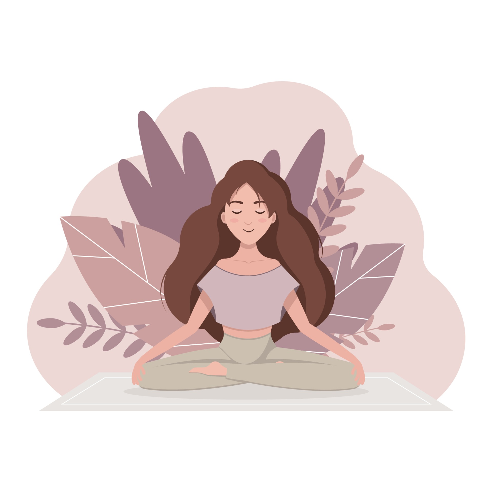

I'm a brand new Software Engineer working toward Full Stack certification. 
Prefered 
  Languages: Ruby, JavaScript, HTML, CSS 
  Frameworks: Ruby on Rails, Vue.js, Bootstrap  
  Databases/Libraries/Tools: Postgres, APIs, Git, GitHub 
I expect to complete my program on November 18, 2022! :mortar_board:	

I am also a mom, yoga teacher, scuba diver, avid reader of fiction and a wannabe childrens book author. 

Reach out on social media!

    
                        

