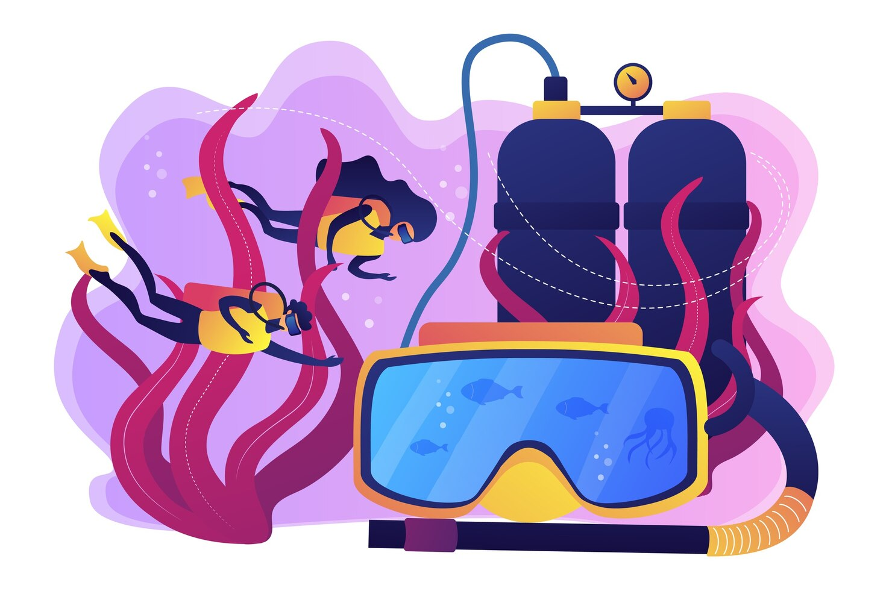

<h3 > I'm a software engineer certified in Full Stack Development who loves learning, experimenting and creating cool stuff. </h3>  

       
I'd love to hear from you!

<h3>I am also a mom, yoga instructor, scuba diver, avid reader of fiction and aspiring childrens book author. </h3>

          

          
       

<h2  align="center"> 📈 &nbsp;My GitHub Stats!</h2>

<a href="https://github.com/robynspaulding">
  
<a href="https://github.com/robynspaulding">
  

